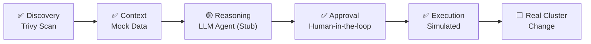

# MVP #1 – Status Update

## Pipeline Status

| Step | Status | Description |
|---|---|---|
| 1. Discovery | ✅ Done | Trivy scans a real image, returns real CVE data |
| 2. Context | ✅ Done (Mock) | Hardcoded test data, NetBox integration planned next |
| 3. Reasoning | 🟡 Stub | Placeholder logic, real LLM call pending API setup |
| 4. Approval | ✅ Done | Working human-in-the-loop gate (CLI-based) |
| 5. Execution | ✅ Done (Simulated) | Displays planned action, no real changes applied yet |

**Result:** Full end-to-end data flow validated — from real vulnerability scan to human approval decision.