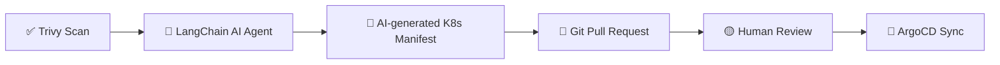
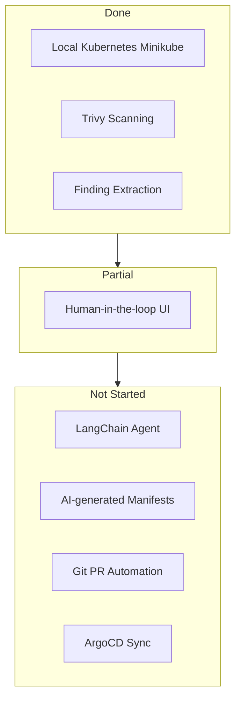

# PoC Status Update

## Target Architecture (per Project Charter)

## Component Status

## Status Table

| Component | Status | Note |
|---|---|---|
| Local Kubernetes (Minikube) | Done | Matches required stack |
| Trivy vulnerability scanning | Done | Matches required stack |
| Finding extraction/normalization | Done | Reusable for LangChain input |
| LangChain-based AI Agent | Not started | Required — replaces raw API stub |
| AI-generated K8s manifests | Not started | Required output format |
| Git branch + PR automation | Not started | Required for human review step |
| ArgoCD installation & sync | Not started | Required infrastructure component |
| Human-in-the-loop via PR review | Partial | Streamlit approval valid concept, must shift to PR-based |

## Out-of-Scope (Confirmed)

- Ansible-based OS/node hardening
- NetBox/CMDB integration
- Autonomous execution without human approval